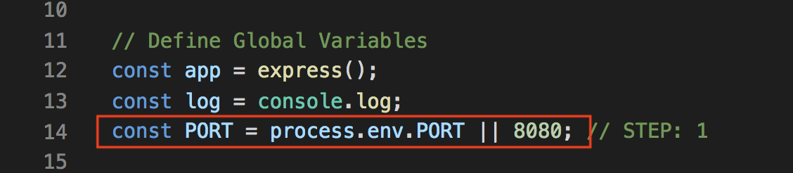
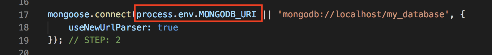
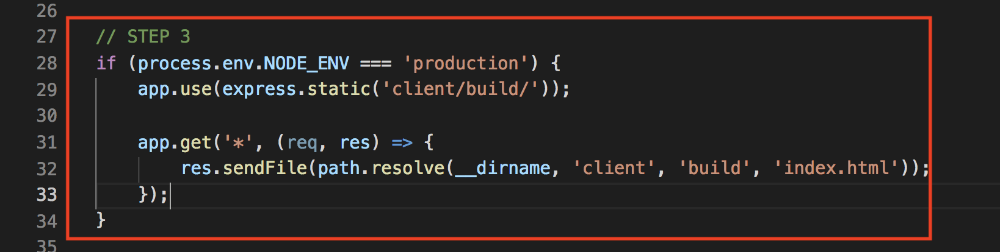
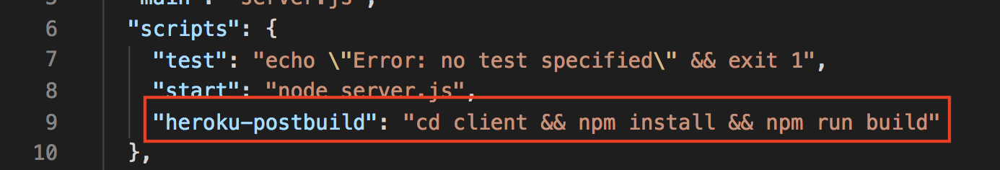

# Deploying MERN Stack to Heroku


We're going to walk you how to deploy a MERN stack app to Heroku.

MERN (Mongo, express, React, and Nodejs)

### Perequesites
1- [Heroku CLI](https://devcenter.heroku.com/articles/heroku-cli)

2- [Git Installed](https://git-scm.com/downloads)


Before you move on the steps, make sure you are logged in with your Heroku Account inside your terminal. You can run `heroku login` in your terminal and then follow the steps to make sure you're logged in.

> Note: all these steps below are done inside the main `server.js` file. In our case, inside server.js. 

Assuming you have the following folder structure

```
├── client
│   ├── build
│   ├── public
│   ├── src
│   ├── .gitignore
│   ├── package.json
│   ├── README.md
│   └──src
├── models
│   ├── user.js
│   ├── books.js
│   └── index.js
├── public
├── routes
├── .gitignore
├── server.js
├── package.json
└── README.MD
```


#### Step 1
> `server.js`

We can't assume that Heroku will have PORT 8080 available. We need set `process.env.PORT` to our PORT variable to use Heroku PORT. Then add 8080 as a fallback port for our localhost development

We should end up with something like this
;


#### Step 2
> `server.js`

Heroku's going to generate an environment variable called `MONGODB_URI` for us to connect to mlab (MongoDB). In order to utilize this variable, we need to set our `mongoose.connect` with that variable. 

It should look like this
;


#### Step 3
> `server.js`

Once our app is on Heroku, we need to send the static build files on our server so that Heroku can serve it. 

How do we know our app is on Heroku?
Well, by default Heroku has this environment variable called `NODE_ENV` with a value set to production. We can write a conditional logic to check if `NODE_ENV` has the value of production, if so, then we know for sure that our app is on Heroku. Then we serve the static files generated by React after we have successfully ran `npm run build` in the client folder.

We should end up having something like this
;


#### Step 4
> `package.json`

You don't want to always keep doing `npm run build` to generate the build folder for you every time you do a change. What if Heroku can do it for us? Well, the good news is, yes it can :)

Heroku has 2 builds scripts that you can run either before or after the build. 

- heroku-prebuild

- heroku-postbuild

We're going to use the `heroku-postbuild` one. This is a change that we need to do inside the package.json, under the scripts section.

It should look like this
;


> Note: In order to run step 5, you need to make sure you already have `git` initialized into your project. A quickly way to check, is by doing `git status` in your terminal. If you see the following message `fatal: Not a git repository` . That means you do not have git initialized into your project. You can run `git init` to initialized git and continue to step 5


#### Step 5
> `open your terminal`

Once we have the above steps completed, we can run the following commands to create a heroku app, configure mlab, and push our code to heroku


```
$ heroku create app_name

$ heroku addons:create mongolab:sandbox

$ git add -A

$ git commit -m "add_message"

$ git push heroku master

$ heroku open

```